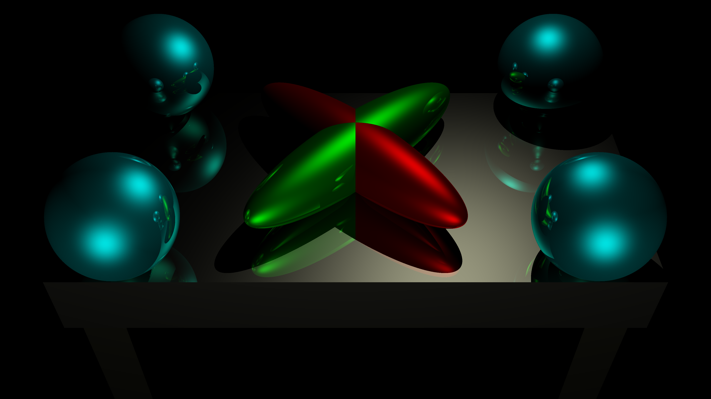

# Ray Tracer - CSE 167x: Computer Graphics - Final Project

## Overview

The ray tracer was created for the final project of the Computer Graphics edX course run by University of California, San Diego. The ray tracer read input text files that specified the scene to be rendered and then performed all the necessary recursive ray tracing computations in order to produce an output image file at a specified resolution. Various input scenes were given in order to test the correctness of the implementation of the ray tracer compared with reference images. The scenes tested all aspects of the ray tracer and required that the lighting equations for ambient, diffuse, specular lighting be correctly implemented and the ray tracing had to be done recursively to a maximum recursion (reflection) count of five. Some of the scenes contained a large number of polygons, such as the Dragon scene (shown below) at 100,000 triangles. These scenes stress tested the ray tracer to ensure that it was designed to be computationally efficient.

## Example output

### Lighting 4K

### Cornell Box 4K

### Thousand spheres 4K

### Stanford Dragon 100,000 Triangles

## Input File Reader

The input files specified the resolution and name of the image that was to be outputted. The number of pixels in the output image was equal to the number of rays that must be cast through the scene (super-sampling was not used), which was the bulk of the computation done in the program. The scene camera was described using a position vector, the viewing direction, the up direction and the Field-of-View angle.

Lights of a particular RGB intensity could be added to the scene in the form of directional and point lights. Every polygon in the scene was assigned ambient, diffuse, shininess, emissive and specular properties that determines its 'material' appearance. The file also had a running transform stack composed of translation, rotation and scaling matrices that could be pushed and popped from the stack. The transform stack was applied to subsequently defined polygons. Spheres were described using a central point and a radius. Vertices could specified individually and then combined to make triangles, with the order of the vertices determining the direction of the normal vector and triangle face. A vertex could a member of multiple triangles.

## Main Loop

Once the scene was specified through the input file, the main loop of the program created a ray for each pixel, intersected the ray through the scene and then obtained a colour for each given pixel. As each ray was independent in our program and has no effect on other rays, the main loop of the program could be fully parallelised. The parallelism was easy to achieve using a simple OpenMP 'for loop' directive. The effect was allow the full utilisation of all 8 cores of the processor, rather than a single core, which greatly increased performance.

## Sampler

Every pixel that had to be coloured required a corresponding ray to be cast from the camera. Each ray consisted of a point vector and a unit direction vector. To create the initial ray the position vector was set to the camera's position. The process of creating a direction vector for the ray can be understood through a visualisation. Based on the direction and up vector of the camera it can be imagined that a mesh screen was placed one unit vector in front of the camera. The direction vectors that was needed for the rays were determined by the normalised direction vector from the camera to each of the holes in the mesh. The size of the mesh was determined by the field of view and the density of holes in the mesh was determined by the resolution. Once the direction was calculated, the ray was cast through the scene.

### Sampler visualisation:

## Intersection

Once the ray was created, the object with the minimum distance from the position vector of the ray was found. Every sphere and triangle in the scene was tested for intersection with the ray to find the closest point of intersection (if any). For scenes with many polygons, this represented many intersection tests and for scenes with many polygons this could have made more efficient by using "bounding boxes" to reduce the number of tests, but this was beyond the scope of the project. Once the closest polygon was found, it was necessary to check if any lights were visible from the intersection point. If so, the properties of the material, the lighting intensity and incident angles were used to determine the colour that would be generated by all the visible lights. If the intersected polygon had a shininess value above zero, the ray had to be reflected based on the incident angle and the above repeated. The ray could be reflected up to five times, with the result of each reflection adding to colour value already generated. For each reflection, the position vector of the ray was given a tiny _boost_ in the reflected direction in order to avoid floating point issues which could cause the ray to intersect with the same polygon that it is being reflected from. Once a thread completed this process, the pixel that the array was associated with was simply assigned the colour that was calculated. The output image was written using the resultant 2D array of colours, once all the rays had been cast through the scene.

### A ray intersecting a surface:

